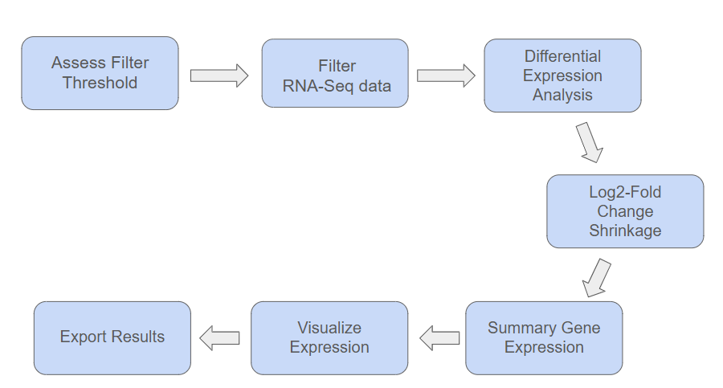

```{r setup, include=FALSE}
knitr::opts_chunk$set(eval = FALSE, message = FALSE, warning = FALSE)
```
## What is ExpreSEd?
ExpreSEd is a package that provides a streamlined pipeline for differential expression analysis using SummarizedExperiment objects, and raw counts data and sample metadata files. Input bulk RNA-seq data, and ExpreSEd will output an optimal filter threshold matrix, log2-fold change shrunken differential analysis results, a summary of expression patterns, and a volcano plot.  ExpreSEd is compatible with R, command line, Docker, and Nextflow programs.

## Workflow
```{r, echo=FALSE, fig.cap="Your caption", out.width="80%", fig.align="center"}

```

## Package Components
```r
├── DESCRIPTION
├── ExpreSEd.Rproj
├── LICENSE
├── LICENSE.md
├── NAMESPACE
├── R
│   ├── DESeq2_analysis.R
│   ├── ExpreSEd-package.R
│   ├── data-documentation.R
│   ├── determine_filter_threshold.R
│   ├── export.R
│   ├── filter_low_exp_gene.R
│   ├── shrinkage.R
│   ├── summarize_genes.R
│   └── volcano_plot.R
├── README.Rmd
├── README.md
├── _pkgdown.yml
├── data
│   └── example_se.rda
├── data-raw
│   └── example_se.R
├── inst
│   └── example_outputs
│       ├── de_results.tsv
│       ├── de_summary.tsv
│       ├── filtering_diagnostics.tsv
│       ├── volcano_plot.pdf
│       └── volcano_plot.png
├── exec
│   └── ADS8192.R
├── man
│   ├── ExpreSEd-package.Rd
│   ├── determine_filter_threshold.Rd
│   ├── example_se.Rd
│   ├── export_outputs.Rd
│   ├── filter_low_exp_genes.Rd
│   ├── gene_regulation_summary.Rd
│   ├── generate_volcano.Rd
│   ├── log2_shrinkage.Rd
│   └── run_DESeq2.Rd
├── tests
│   ├── testthat
│   │   ├── test-DESeq2_analysis.R
│   │   ├── test-determine_filter_threshold.R
│   │   ├── test-export.R
│   │   ├── test-filter_low_exp_genes.R
│   │   ├── test-shrinkage.R
│   │   ├── test-summarize_genes.R
│   │   └── test-volcano_plot.R
│   └── testthat.R
└── vignettes
    ├── about.Rmd
    ├── cli-analysis.Rmd
    ├── cli-analysis.html
    ├── getting-started.Rmd
    ├── prebuilt_data.RData
    ├── r-analysis.Rmd
    ├── r-analysis.html
    └── workflow.png
```
---

## Reflection

### Key Aspects/ Takeaways

- Specify GitHub commits
- Writing functions, creating a package, and operating containers

### Future Work

- Alter R pipeline input to accept raw count and sample meta data.
- Combine R, CLI and nextflow workflows into a single branch